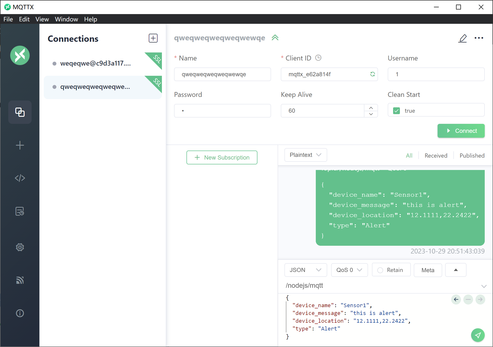
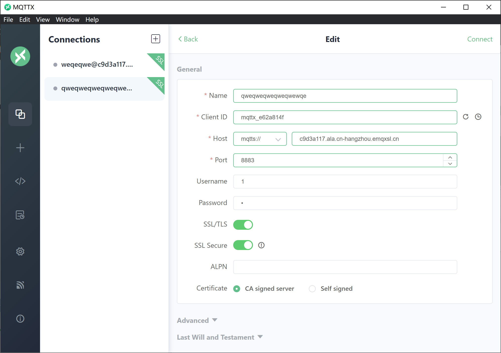

# IoT

This file should help get you started run this code.

I use `koa.js` and `mqttx `to setup this project.

## MQTTX Setup

You can download the client from: https://mqttx.app/zh/downloads

If you correctly setup it, you can see page like this:



Next, you can create a connection, this is my settings:



You can set your own `Name `and `ClientID`, the username and password is all `1`, then connect.

After connected, You can send message to the server I created, in this type:

```json
{
  "device_name": "Your device name",
  "device_message": "this is alert",
  "device_location": "12.1111,22.2422", // this is latitude and longitude
  "type": "Alert" // Alert or Info
}
```

Before you send message, you should ensure that you have created the device on the front-end.

## Project Setup

```sh
cd server
npm install
```

### Run

```sh
node app.js
```

